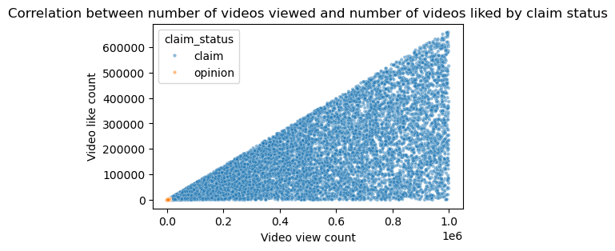
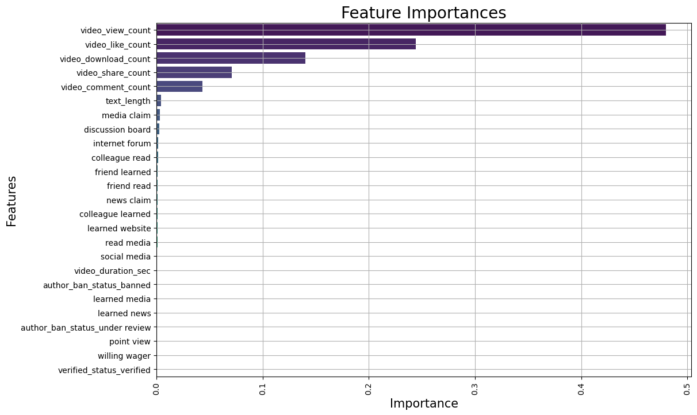

## Predictive Model for TikTok Video Content Classification

## Project Overview
This project aims to develop a predictive model to determine whether a TikTok video contains a claim or offers an opinion. The model utilizes data from TikTok videos and user interactions, including likes, shares, comments, and view counts. The final Random Forest ensemble model performed with an accuracy of 99.6% and a recall also of 99.6% on the validation data, demonstrating its effectiveness in classifying content.

## Business Understanding 
According to arxiv.org, researchgate.net, and socialinsider.io, it's worth noting that virality on TikTok is influenced by a variety of factors, including the quality of the content, the timing of the post, and the level of user engagement.
The stakeholders for this project are the TikTok data team and cross-functional team members. The business problem addressed is the efficient processing of user reports, which currently involves manual review. Our predictive model aims to automate this process, thereby increasing response time and improving overall system efficiency.

## Data Understanding 
The dataset used for this project consists of various features related to TikTok videos and user interactions. These include video duration, view count, like count, share count, download count, comment count, and verification status. Some of these features showed high correlation. Despite the presence of missing data in some columns, the dataset appears to be in a consistent format.

## Modeling and Evaluation 
Two machine learning models were developed for this project: a Random Forest ensemble model and a Gradient Boosting model. Both models were evaluated using several metrics including accuracy, precision, recall, and F1 score. The models achieved an accuracy of 99.6% on the validation data, demonstrating their effectiveness in classifying content.

## Conclusion
The predictive model developed in this project effectively classifies TikTok videos as either claims or opinions. This model can automate the initial stages of the claims process, thereby increasing response time and improving overall system efficiency. Future steps to expand on this project could include refining the model to handle more complex scenarios, or integrating it into a broader content moderation system.